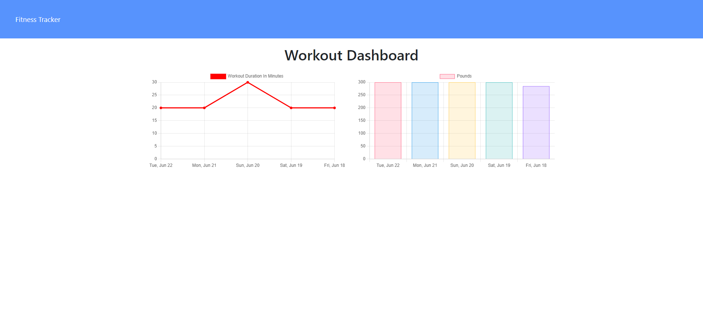

# 18-Nosql-Homewowrk-workout-tracker

  # Table of Contents       

* [License](#license)

 * [Description](#description)
 * [Usage](#usage)
 * [Test](#test)
 * [Installation](#installation)
 * [Author](#author)
 * [Contributors](#contributors)
 * [Contact](#contact)
 * [Link](#link)
 * [Screenshots](#screenshots)
 
## License
    
    This project is licensed under the MIT
 
 ## Description:
 * This app allows the user to view, create and track daily workouts.
 * The user can add exercises to the most recent workout plan.
 * The user can add new exercises to a workout plan.
 * The user can access a stats page to review weight and duration of the last 5 workouts.
 
 ## Usage:
 * Track and update workouts
 
 ## Test:
  * Currently there is no test available
 
 
 ## Installation:
 * There is currently no installation available and must be accessed via heroku, visit the  link in the link  section of this readme file.
 
 ### Author:
  Rebecca Lacer 
 
 
 ### Contributors:
  N/A
 
 
 ### Contact
 
* Github: https://github.com/RLacer
* Email: r.a.lacer@hotmail.com

### Link
Heroku Deployment: https://limitless-mountain-74106.herokuapp.com/

## Screenshots

<footer>This readme was generated using my homework assignment 9, Node.js readme generator.🏫</footer>